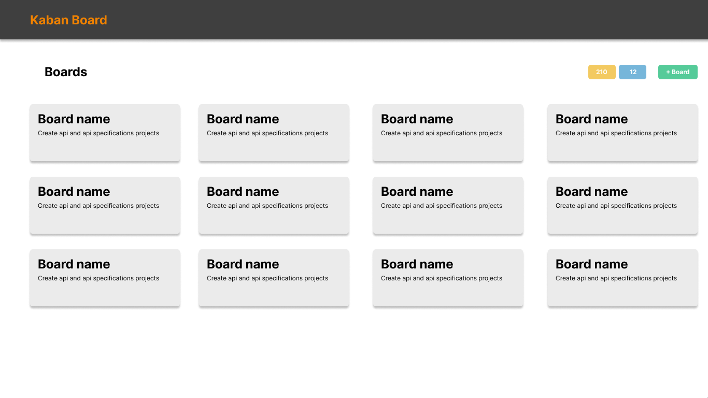
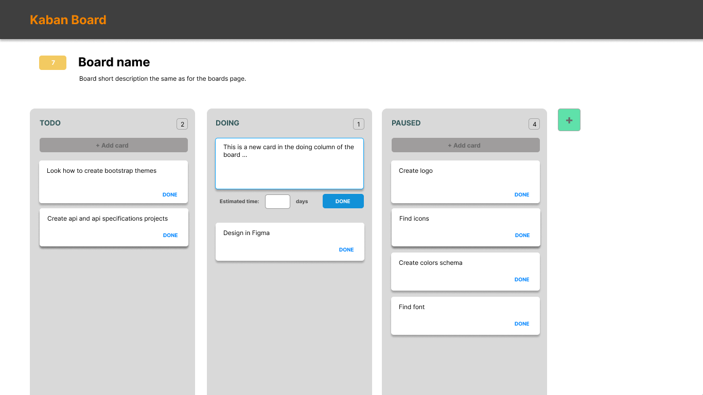

# Kaban Board

Minimalistic Kaban board.

## Design

This project is in an early stage and I haven't yet designed or thinked about the whole application. Here is the first draft.

See the Figma viewer : [Kaban Board Design](https://www.figma.com/file/Stxq8Mwo3vQn3pOG09MSZ8?embed_host=share&kind=&node-id=0%3A1&t=lBm5dv7LG469OUzt-1&viewer=1)

## Technologies

This project was generated with [Angular CLI](https://github.com/angular/angular-cli) version 15.0.4.

## Requirements

- [Docker]()
- [NPM]()

## Configuration

### Crceate a new project

- First create a new project, for that, login to your console at
<https://console.firebase.google.com/>

- Choose a name to your project

### Authentication

### Firestore

- First add Firebase to the created application, choose the web version.

## Development server

Run `ng serve` for a dev server. Navigate to `http://localhost:4200/`.
The application will automatically reload if you change any of the source files.

## Code scaffolding

Run `ng generate component component-name` to generate a new component. You can
also use `ng generate directive|pipe|service|class|guard|interface|enum|module`.

## Build

Run `ng build` to build the project. The build artifacts will be stored in the
`dist/` directory.

## Running unit tests

Run `ng test` to execute the unit tests
via [Karma](https://karma-runner.github.io).

## Running end-to-end tests

Run `ng e2e` to execute the end-to-end tests via a platform of your choice. To
use this command, you need to first add a package that implements end-to-end
testing capabilities.

## Deployement

Run `firebase deploy`to deploy the site to the appropriate project.

## References

- <https://github.com/angular/angularfire>
- <https://firebase.google.com/docs/firestore/use-rest-api>
- <https://www.jeansnyman.com/posts/google-firestore-rest-api-examples/>
- <https://material.angular.io/>

J'ai implementer une petite app en angular pour tester l'authentication avec Firebase.

<https://angular-board-issues-53ae5.web.app/>

Si en y as qui veulent tester et me rendre un feedback.

- On sais s'enregister et se connecter avec email et password
- Utiliser son compte Google
- Y as une page pour le password oublié
- Y as une page profile, accessible via le menu a droite
- On peut se deconnecter, via le menu aussi

Faite pas attention au design, c'est pas mon fort :p

PS: Pour l'enrigstrement avec email/password, il y as un email de confirmation qui est envoyé, il faut confirmé l'inscription pour se connecter.
Une fois l'email verifié vous n'etez pas rediriger vers le site, il faut manuellement retourner sur <https://angular-board-issues-53ae5.web.app/>
J'ai pas encore trouvé comment faire cette redirection... C'est pareil si vous changer votre mot de passe, la redirection ne se fait pas.
