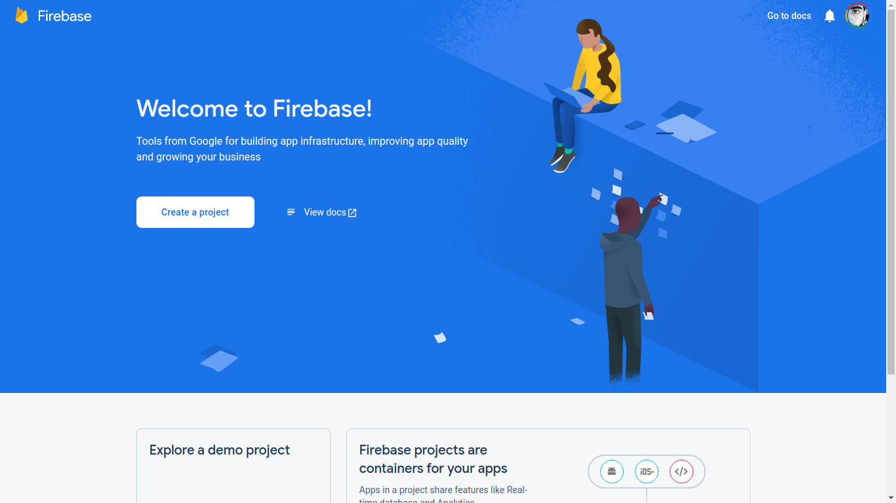
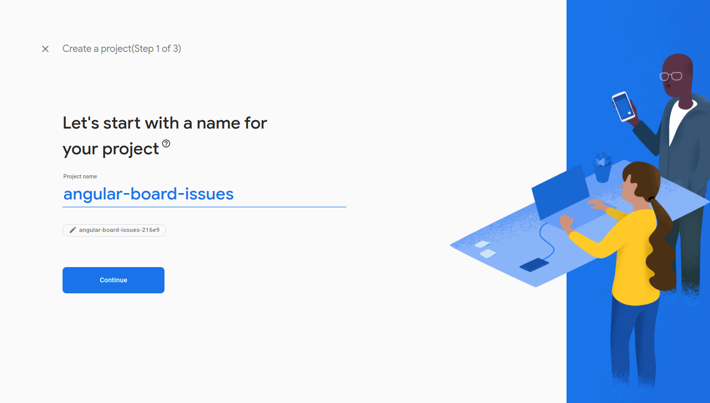
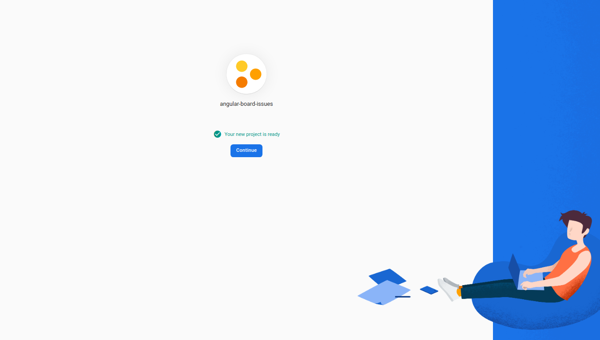
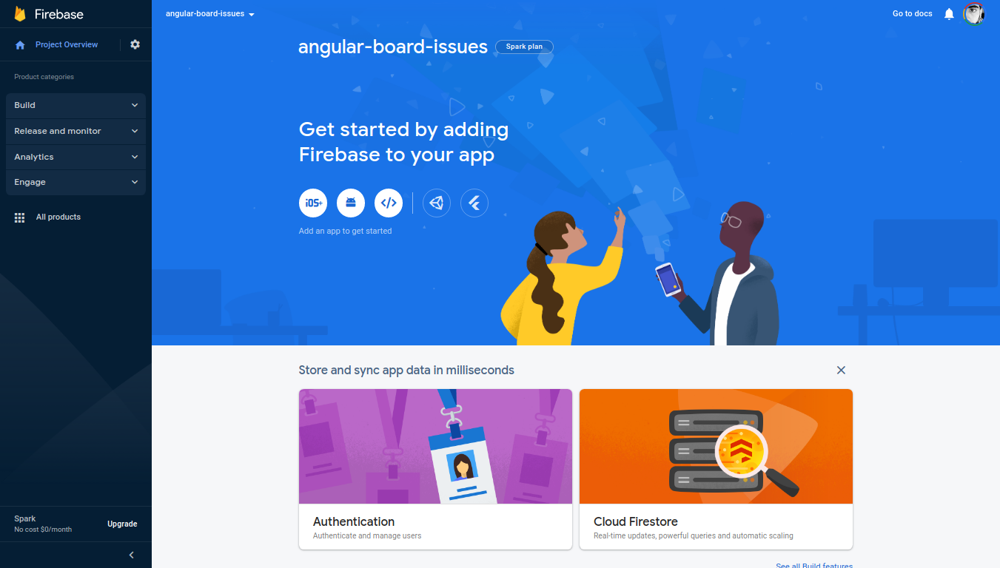
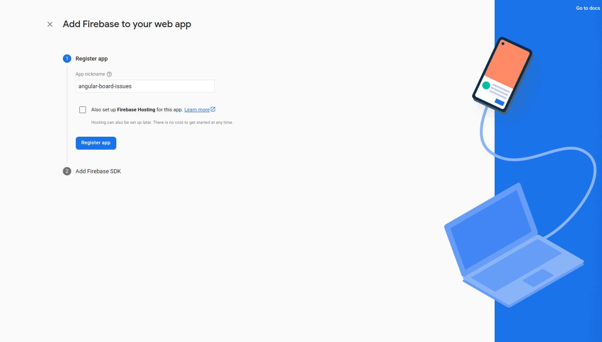
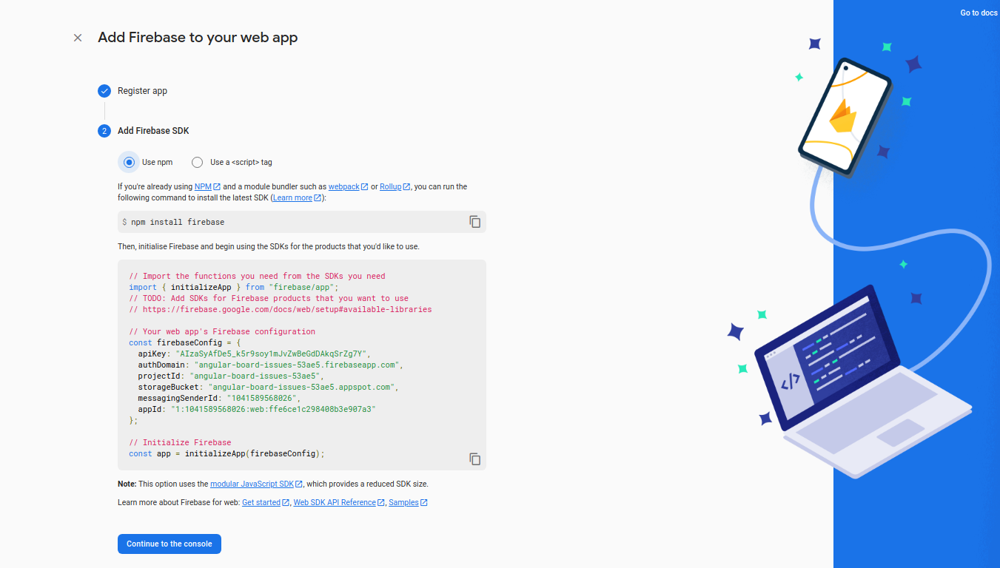

# Angular Board Issues

## Technologies

This project was generated with [Angular CLI](https://github.com/angular/angular-cli) version 15.0.4.

It use [Angular Material](https://material.angular.io/) and [Firebase](https://firebase.google.com/).

This application is build and tested with [GitHub Actions](https://github.com/features/actions) and pushed to [DockerHub](https://hub.docker.com/).

## Requirements

- [Docker]()
- [NPM]()

## Usage

You will need to register a new applicati to your Firestore console before using this application.

- First create a new project, for that login to your console at <https://console.firebase.google.com/>













```shell

```

## Development server

Run `ng serve` for a dev server. Navigate to `http://localhost:4200/`. The application will automatically reload if you change any of the source files.

## Code scaffolding

Run `ng generate component component-name` to generate a new component. You can also use `ng generate directive|pipe|service|class|guard|interface|enum|module`.

## Build

Run `ng build` to build the project. The build artifacts will be stored in the `dist/` directory.

## Running unit tests

Run `ng test` to execute the unit tests via [Karma](https://karma-runner.github.io).

## Running end-to-end tests

Run `ng e2e` to execute the end-to-end tests via a platform of your choice. To use this command, you need to first add a package that implements end-to-end testing capabilities.

## References

- <https://material.angular.io/>
